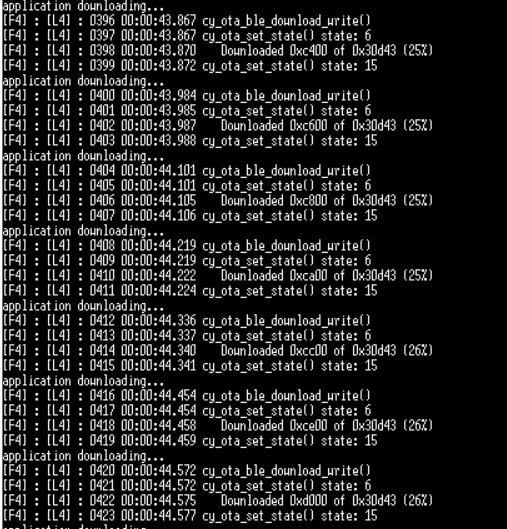

# Bluetooth&reg; LE battery server with OTA

This code example demonstrates the implementation of a simple Bluetooth&reg; battery service. The battery service exposes the battery level of the device and supports over-the-air (OTA) update over a Bluetooth&reg; Low Energy connection. The app downloads and writes the image to the secondary slot. On the next reboot, MCUboot copies the new image over to the primary slot and runs the application. If the new image is not validated in run time, on the next reboot, MCUboot reverts to the previously validated image.


[View this README on GitHub.](https://github.com/Infineon/mtb-example-btstck-freertos-cyw20829-battery-server-ota)

[Provide feedback on this code example.](https://cypress.co1.qualtrics.com/jfe/form/SV_1NTns53sK2yiljn?Q_EED=eyJVbmlxdWUgRG9jIElkIjoiQ0UyMzAyOTkiLCJTcGVjIE51bWJlciI6IjAwMi0zMDI5OSIsIkRvYyBUaXRsZSI6IkJsdWV0b290aCZyZWc7IExFIEJhdHRlcnkgU2VydmVyIHdpdGggT1RBIHVwZGF0ZSIsInJpZCI6ImFtbWwiLCJEb2MgdmVyc2lvbiI6IjUuMi4wIiwiRG9jIExhbmd1YWdlIjoiRW5nbGlzaCIsIkRvYyBEaXZpc2lvbiI6Ik1DRCIsIkRvYyBCVSI6IklDVyIsIkRvYyBGYW1pbHkiOiJCVEFCTEUifQ==)


## Requirements

- [ModusToolbox&trade; software](https://www.infineon.com/modustoolbox) v3.0 or later (tested with v3.0)
- Board support package (BSP) minimum required version for:
   - CYW920829M2EVK-02: v1.0.1
- Programming language: C
- Associated parts:[AIROC&trade; CYW20829 Bluetooth&reg; LE SoC](https://www.infineon.com/cms/en/product/promopages/airoc20829)

## Supported toolchains (make variable 'TOOLCHAIN')

- GNU Arm&reg; Embedded Compiler v10.3.1 (`GCC_ARM`) - Default value of `TOOLCHAIN`

## Supported kits (make variable 'TARGET')

- [AIROC&trade; CYW20829 Bluetooth&reg; LE Evaluation Kit](https://www.infineon.com/CYW920829M2EVK-02) (`CYW920829M2EVK-02`) – Default value of `TARGET`

## Hardware setup

This example uses the kit’s default configuration. See the respective kit guide to ensure that the kit is configured correctly.

The AIROC&trade; CYW20829 Bluetooth&reg; kit (CYW920829M2EVK-02) ships with KitProg3 version 2.2.1 installed. The ModusToolbox&trade; software requires KitProg3 with latest version 2.40. Before using this code example, make sure that the board is upgraded to KitProg3. The tool and instructions are available in the Firmware Loader GitHub repository. If you do not upgrade, you will see an error such as "unable to find CMSIS-DAP device" or "KitProg firmware is out of date".

## Software setup

1. To view the battery level in Battery Service, Download and install the AIROC&trade; Bluetooth&reg; Connect App for [iOS](https://apps.apple.com/in/app/airoc-bluetooth-connect-app/id6443702288) or [Android](https://play.google.com/store/apps/details?id=com.infineon.airocbluetoothconnect).


   **Figure 1. Download and install the AIROC&trade; Bluetooth&reg; Connect App**

   

2. Install a terminal emulator if you don't have one. Instructions in this document use [Tera Term](https://ttssh2.osdn.jp/index.html.en).

3. For OTA update functionality, download and install a peer app from the [OTA peer apps repo](https://github.com/Infineon/btsdk-peer-apps-ota). This example uses the Windows app (*WsOtaUpgrade.exe*).

This example requires no additional software or tools.


## Using the code example

Create the project and open it using one of the following:

<details><summary><b>In Eclipse IDE for ModusToolbox&trade; software</b></summary>

1. Click the **New Application** link in the **Quick Panel** (or, use **File** > **New** > **ModusToolbox&trade; Application**). This launches the [Project Creator](https://www.infineon.com/ModusToolboxProjectCreator) tool.

2. Pick a kit supported by the code example from the list shown in the **Project Creator - Choose Board Support Package (BSP)** dialog. This kit should be AIROC&trade; LE CYW20829 Bluetooth&reg; LE Evaluation Kit.

   When you select a supported kit, the example is reconfigured automatically to work with the kit. To work with a different supported kit later, use the [Library Manager](https://www.infineon.com/ModusToolboxLibraryManager) to choose the BSP for the supported kit. You can use the Library Manager to select or update the BSP and firmware libraries used in this application. To access the Library Manager, click the link from the **Quick Panel**.

   You can also just start the application creation process again and select a different kit.

   If you want to use the application for a kit not listed here, you may need to update the source files. If the kit does not have the required resources, the application may not work.

3. In the **Project Creator - Select Application** dialog, choose the example by enabling the checkbox.

4. (Optional) Change the suggested **New Application Name**.

5. The **Application(s) Root Path** defaults to the Eclipse workspace which is usually the desired location for the application. If you want to store the application in a different location, you can change the *Application(s) Root Path* value. Applications that share libraries should be in the same root path.

6. Click **Create** to complete the application creation process.

For more details, see the [Eclipse IDE for ModusToolbox&trade; software user guide](https://www.infineon.com/MTBEclipseIDEUserGuide) (locally available at *{ModusToolbox&trade; software install directory}/docs_{version}/mtb_ide_user_guide.pdf*).

</details>

<details><summary><b>In command-line interface (CLI)</b></summary>

ModusToolbox&trade; software provides the Project Creator as both a GUI tool and the command line tool, "project-creator-cli". The CLI tool can be used to create applications from a CLI terminal or from within batch files or shell scripts. This tool is available in the *{ModusToolbox&trade; software install directory}/tools_{version}/project-creator/* directory.

Use a CLI terminal to invoke the "project-creator-cli" tool. On Windows, use the command line "modus-shell" program provided in the ModusToolbox&trade; software installation instead of a standard Windows command-line application. This shell provides access to all ModusToolbox&trade; software tools. You can access it by typing `modus-shell` in the search box in the Windows menu. In Linux and macOS, you can use any terminal application.

The 'project-creator-cli' tool has the following arguments:

Argument | Description | Required/optional
---------|-------------|-----------
`--board-id` | Defined in the `<id>` field of the [BSP](https://github.com/Infineon?q=bsp-manifest&type=&language=&sort=) manifest | Required
`--app-id`   | Defined in the `<id>` field of the [CE](https://github.com/Infineon?q=ce-manifest&type=&language=&sort=) manifest | Required
`--target-dir`| Specify the directory in which the application is to be created if you prefer not to use the default current working directory | Optional
`--user-app-name`| Specify the name of the application if you prefer to have a name other than the example's default name | Optional

<br />

The following example clones the "[mtb-example-btstck-freertos-cyw20829-battery-server-ota](https://github.com/Infineon/mtb-example-btstck-freertos-cyw20829-battery-server-ota)" application with the desired name "BatteryServer OTA" configured for the *CYW920829M2EVK-02* BSP into the specified working directory, *C:/mtb_projects*:

   ```
   project-creator-cli --board-id CYW920829M2EVK-02 --app-id mtb-example-btstck-freertos-cyw20829-battery-server-ota --user-app-name BatteryServer OTA --target-dir "C:/mtb_projects"
   ```

**Note:** The project-creator-cli tool uses the `git clone` and `make getlibs` commands to fetch the repository and import the required libraries. For details, see the "Project creator tools" section of the [ModusToolbox&trade; software user guide](https://www.infineon.com/ModusToolboxUserGuide) (locally available at *{ModusToolbox&trade; software install directory}/docs_{version}/mtb_user_guide.pdf*).

To work with a different supported kit later, use the [Library Manager](https://www.infineon.com/ModusToolboxLibraryManager) to choose the BSP for the supported kit. You can invoke the Library Manager GUI tool from the terminal using `make library-manager` command or use the Library Manager CLI tool "library-manager-cli" to change the BSP.

The "library-manager-cli" tool has the following arguments:

Argument | Description | Required/optional
---------|-------------|-----------
`--add-bsp-name` | Name of the BSP that should be added to the application | Required
`--set-active-bsp` | Name of the BSP that should be as active BSP for the application | Required
`--add-bsp-version`| Specify the version of the BSP that should be added to the application if you do not wish to use the latest from manifest | Optional
`--add-bsp-location`| Specify the location of the BSP (local/shared) if you prefer to add the BSP in a shared path | Optional

<br />

Following example adds the  BSP to the already created application and makes it the active BSP for the app:

   ```
   library-manager-cli --project "C:/mtb_projects/KeyboardSolution" --add-bsp-name CYW920829M2EVK-02 --add-bsp-version "latest-v4.X" --add-bsp-location "local"

   library-manager-cli --project "C:/mtb_projects/KeyboardSolution" --set-active-bsp APP_CYW920829M2EVK-02
   ```

</details>

<details><summary><b>In third-party IDEs</b></summary>

Use one of the following options:

- **Use the standalone [Project Creator](https://www.infineon.com/ModusToolboxProjectCreator) tool:**

   1. Launch Project Creator from the Windows Start menu or from *{ModusToolbox&trade; software install directory}/tools_{version}/project-creator/project-creator.exe*.

   2. In the initial **Choose Board Support Package** screen, select the BSP, and click **Next**.

   3. In the **Select Application** screen, select the appropriate IDE from the **Target IDE** drop-down menu.

   4. Click **Create** and follow the instructions printed in the bottom pane to import or open the exported project in the respective IDE.

<br />

- **Use command-line interface (CLI):**

   1. Follow the instructions from the **In command-line interface (CLI)** section to create the application.

   2. Export the application to a supported IDE using the `make <ide>` command.

   3. Follow the instructions displayed in the terminal to create or import the application as an IDE project.

For a list of supported IDEs and more details, see the "Exporting to IDEs" section of the [ModusToolbox&trade; software user guide](https://www.infineon.com/ModusToolboxUserGuide) (locally available at *{ModusToolbox&trade; software install directory}/docs_{version}/mtb_user_guide.pdf*).

</details>

## Operation

1. Connect the board to your PC using the provided USB cable through the MiniProg4 USB connector.

2. Program the board using one of the following:

   <details><summary><b>Using Eclipse IDE for ModusToolbox&trade; software</b></summary>

      1. Select the application project in the Project Explorer.

      2. In the **Quick Panel**, scroll down, and click **\<Application Name> Program (KitProg3_MiniProg4)**.
   </details>

   <details><summary><b>Using CLI</b></summary>

     From the terminal, execute the `make program` command to build and program the application using the default toolchain to the default target. The default toolchain is specified in the application's Makefile but you can override this value manually:
      ```
      make program TOOLCHAIN=<toolchain>
      ```

      Example:
      ```
      make program TOOLCHAIN=GCC_ARM
      ```
   </details>

3. After programming, the application starts automatically.

## Debugging

You can debug the example to step through the code. In the IDE, use the **\<Application Name> Debug (KitProg3_MiniProg4)** configuration in the **Quick Panel**. For details, see the "Program and debug" section in the [Eclipse IDE for ModusToolbox&trade; software user guide](https://www.infineon.com/MTBEclipseIDEUserGuide).

## Design and implementation
The battery server application supports the over-the-air update feature.

## Steps to run the OTA Battery Server Application
The MCUboot application must built and programmed separately.

### Steps to Create the MCUboot application

1. Open a CLI terminal and run the following command:
   ```
   git clone https://github.com/JuulLabs-OSS/mcuboot.git
   ```
2. Navigate to the cloned mcuboot folder:
   ```
   cd mcuboot
   ```
3. Change the branch to get the appropriate version:
   ```
   git checkout v1.8.4-cypress
   ```
4. Pull in sub-modules to build mcuboot:
   ```
   git submodule update --init --recursive
   ```
5. Install the required Python packages mentioned in mcuboot/scripts/requirements.txt. Please see the ModusToolbox&trade; user guide for information on CY_PYTHON_PATH environment variable usage:
   ```
   cd mcuboot/scripts
   pip install -r requirements.txt

### Note
Check the cysecuretools version. It must be version 4.2.0 or above for CYW20829

   Command to check the cysecure tool version

   ```
   cysecuretools version
   ```

If in case your system has the older version of the cysecuretools, use the following command to update the cysecuretools version
   ```
   pip install --upgrade --force-reinstall cysecuretools
   ```
### Steps to program the MCUboot application

1. In the CLI terminal navigate to the cypress folder
   ```
   cd mcuboot/boot/cypress
   ```
2. Copy cyw20829_xip_swap_single.json from the battery server application in flash_map_json folder and  paste it in the mcuboot/boot/cypress directory.
3. Use the following command to build the MCUboot application.
   ```
    make clean app APP_NAME=MCUBootApp PLATFORM=CYW20829 USE_CUSTOM_DEBUG_UART=1 USE_EXTERNAL_FLASH=1 USE_XIP=1 FLASH_MAP=./cyw20829_xip_swap_single.json TOOLCHAIN_PATH=c:/Users/$(USERNAME)/ModusToolbox/tools_3.1/gcc
    ```
4. Run the following command
   ```
   export OPENOCD=C:/Users/$(USERNAME)/ModusToolbox/tools_3.1/openocd
   ```
5. Use the following command to erase the board
   ```
    ${OPENOCD}/bin/openocd -s "$OPENOCD/scripts" -f "$OPENOCD/scripts/interface/kitprog3.cfg" -c "set ENABLE_ACQUIRE 0" -c "set SMIF_BANKS { 0 {addr 0x60000000 size 0x800000 psize 0x100 esize 0x40000} }" -f $OPENOCD/scripts/target/cyw20829.cfg -c "init; reset init; flash erase_address 0x60000000 0x100000; shutdown"
    ```
6. Run the following command to program the MCUboot application.
   ```
   ${OPENOCD}/bin/openocd -s "$OPENOCD/scripts" -f "$OPENOCD/scripts/interface/kitprog3.cfg" -c "set ENABLE_ACQUIRE 0" -c "set SMIF_BANKS { 0 {addr 0x60000000 size 0x100000 psize 0x100 esize 0x1000} }" -f $OPENOCD/scripts/target/cyw20829.cfg -c "init; reset init; flash write_image "MCUBootApp/out/CYW20829/Debug/MCUBootApp.hex" 0x00000000; init; reset init; reset run; shutdown"

### Steps to program the OTA enabled Battery Server application
1. Click on the build application in the Quick Panel.
2. Click on the terminal in the ModusToolbox&trade; IDE
3. Run the following command
   ```
   export OPENOCD=C:/Users/$(USERNAME)/ModusToolbox/tools_3.1/openocd
   ```
5. Command to program the OTA enabled battery server application
   ```
   ${OPENOCD}/bin/openocd -s "$OPENOCD/scripts" -f "$OPENOCD/scripts/interface/kitprog3.cfg" -c "set ENABLE_ACQUIRE 0" -c "set SMIF_BANKS { 0 {addr 0x60000000 size 0x100000 psize 0x100 esize 0x1000} }" -f $OPENOCD/scripts/target/cyw20829.cfg -c "init; reset init; flash write_image "build/APP_CYW920829M2EVK-02/Release/mtb-example-btstack-freertos-cyw20829-battery-server-ota.final.hex"; init; reset init; reset run; shutdown"
   ```

### Steps to use the OTA update service
The app also supports OTA updates over Bluetooth&reg; LE. A peer app is used to push an updated image to the device. It can be downloaded from the [OTA peer apps](https://github.com/Infineon/btsdk-peer-apps-ota) repo. This example uses the Windows app for pushing an OTA update image.


#### For preparing the OTA update image, do the following changes to the app:
1. Update the app version number in the Makefile by changing the OTA_APP_VERSION_MAJOR, OTA_APP_VERSION_MINOR, OTA_APP_VERSION_BUILD. In this example, update the version to 1.1.0 by modifying OTA_APP_VERSION_MINOR to 1.

2. Build the app, but DO NOT PROGRAM. This version of the app will be used to push to the device via the peer Windows app (WsOtaUpgrade.exe).

3. In the project directory, navigate to build/<TARGET>/Config and locate the .bin file. Copy this file to the same directory as the peer app (WsOtaUpgrade.exe). It is located at btsdk-peer-apps-ota/tree/master/Windows/WsOtaUpgrade/Release/<System Type>.

4. Open the terminal and navigate to WsOtaUpgrade.exe. Initiate the update process by running the following command:
   ```
   ./WsOtaUpgrade.exe <App_name>.bin
   ```
5. In the dialog box that appears, select your device and click OK (IFX KEYBOARD in this case). In the next window, click **Start** to begin pushing the OTA update image to the device.

   **Figure 2. Select your device**
   
   

   **Figure 3. WsOtaUpgrade app start**

   

You can monitor the progress on the Windows peer app via the progress bar or via the device terminal, which prints the percentage of download completed.

**Figure 4. WsOtaUpgrade progress bar**


**Figure 5. Download progress**



**Figure 6. MCUboot reboot**


### Steps to update OTA via Android application
1. Open the LE OTA application on the Android device.
2. Tap to select the desired device
3. Select **Battery Server**.
4. Click **Connect**.
5. Tap to select the OTA image.
6. Navigate to the directory where the .bin is located.
7. Click on **Update** to start OTA.

**Figure 6. Steps to update OTA**


### Resources and settings
**Table 1. Application resources**

 Resource  |  Alias/object     |    Purpose
 :-------  | :------------     | :------------
 UART (HAL)| cy_retarget_io_uart_obj| UART HAL object used by retarget-io for debug UART port
<br />

## Related resources


Resources  | Links
-----------|----------------------------------
Code examples  | [Using ModusToolbox&trade; software](https://github.com/Infineon/Code-Examples-for-ModusToolbox-Software) on GitHub
Device documentation | [AIROC&trade; CYW20829 Bluetooth&reg; LE SoC](https://www.infineon.com/cms/en/product/promopages/airoc20829)
Development kits | Select your kits from the [Evaluation board finder](https://www.infineon.com/cms/en/design-support/finder-selection-tools/product-finder/evaluation-board)
Libraries on GitHub | [core-lib](https://github.com/Infineon/core-lib) – Core library <br /> [core-make](https://github.com/Infineon/core-make) – Core GNU make build system <br /> [mtb-hal-cat1](https://github.com/Infineon/mtb-hal-cat1) – Hardware Abstraction Layer (HAL) library <br /> [mtb-pdl-cat1](https://github.com/Infineon/mtb-pdl-cat1) – Peripheral Driver Library (PDL) <br /> [retarget-io](https://github.com/Infineon/retarget-io) – Utility library to retarget STDIO messages to a UART port
Tools  | [Eclipse IDE for ModusToolbox&trade;](https://www.infineon.com/modustoolbox) – ModusToolbox&trade; software is a collection of easy-to-use software and tools enabling rapid development with Infineon MCUs, covering applications from embedded sense and control to wireless and cloud-connected systems using AIROC&trade; Wi-Fi & Bluetooth&reg; connectivity devices.

<br />

## Other resources

Infineon provides a wealth of data at [www.infineon.com](https://www.infineon.com) to help you select the right device, and quickly and effectively integrate it into your design.


## Document history

Document title: *CE238975* – *AIROC&trade; CYW20829 Bluetooth&reg; LE battery server with OTA*

 Version | Description of change
 ------- | ---------------------
 1.0.0   | New code example

<br>


---------------------------------------------------------

© Cypress Semiconductor Corporation, 2023. This document is the property of Cypress Semiconductor Corporation, an Infineon Technologies company, and its affiliates ("Cypress").  This document, including any software or firmware included or referenced in this document ("Software"), is owned by Cypress under the intellectual property laws and treaties of the United States and other countries worldwide.  Cypress reserves all rights under such laws and treaties and does not, except as specifically stated in this paragraph, grant any license under its patents, copyrights, trademarks, or other intellectual property rights.  If the Software is not accompanied by a license agreement and you do not otherwise have a written agreement with Cypress governing the use of the Software, then Cypress hereby grants you a personal, non-exclusive, nontransferable license (without the right to sublicense) (1) under its copyright rights in the Software (a) for Software provided in source code form, to modify and reproduce the Software solely for use with Cypress hardware products, only internally within your organization, and (b) to distribute the Software in binary code form externally to end users (either directly or indirectly through resellers and distributors), solely for use on Cypress hardware product units, and (2) under those claims of Cypress's patents that are infringed by the Software (as provided by Cypress, unmodified) to make, use, distribute, and import the Software solely for use with Cypress hardware products.  Any other use, reproduction, modification, translation, or compilation of the Software is prohibited.
<br>
TO THE EXTENT PERMITTED BY APPLICABLE LAW, CYPRESS MAKES NO WARRANTY OF ANY KIND, EXPRESS OR IMPLIED, WITH REGARD TO THIS DOCUMENT OR ANY SOFTWARE OR ACCOMPANYING HARDWARE, INCLUDING, BUT NOT LIMITED TO, THE IMPLIED WARRANTIES OF MERCHANTABILITY AND FITNESS FOR A PARTICULAR PURPOSE.  No computing device can be absolutely secure.  Therefore, despite security measures implemented in Cypress hardware or software products, Cypress shall have no liability arising out of any security breach, such as unauthorized access to or use of a Cypress product. CYPRESS DOES NOT REPRESENT, WARRANT, OR GUARANTEE THAT CYPRESS PRODUCTS, OR SYSTEMS CREATED USING CYPRESS PRODUCTS, WILL BE FREE FROM CORRUPTION, ATTACK, VIRUSES, INTERFERENCE, HACKING, DATA LOSS OR THEFT, OR OTHER SECURITY INTRUSION (collectively, "Security Breach").  Cypress disclaims any liability relating to any Security Breach, and you shall and hereby do release Cypress from any claim, damage, or other liability arising from any Security Breach.  In addition, the products described in these materials may contain design defects or errors known as errata which may cause the product to deviate from published specifications. To the extent permitted by applicable law, Cypress reserves the right to make changes to this document without further notice. Cypress does not assume any liability arising out of the application or use of any product or circuit described in this document. Any information provided in this document, including any sample design information or programming code, is provided only for reference purposes.  It is the responsibility of the user of this document to properly design, program, and test the functionality and safety of any application made of this information and any resulting product.  "High-Risk Device" means any device or system whose failure could cause personal injury, death, or property damage.  Examples of High-Risk Devices are weapons, nuclear installations, surgical implants, and other medical devices.  "Critical Component" means any component of a High-Risk Device whose failure to perform can be reasonably expected to cause, directly or indirectly, the failure of the High-Risk Device, or to affect its safety or effectiveness.  Cypress is not liable, in whole or in part, and you shall and hereby do release Cypress from any claim, damage, or other liability arising from any use of a Cypress product as a Critical Component in a High-Risk Device. You shall indemnify and hold Cypress, including its affiliates, and its directors, officers, employees, agents, distributors, and assigns harmless from and against all claims, costs, damages, and expenses, arising out of any claim, including claims for product liability, personal injury or death, or property damage arising from any use of a Cypress product as a Critical Component in a High-Risk Device. Cypress products are not intended or authorized for use as a Critical Component in any High-Risk Device except to the limited extent that (i) Cypress's published data sheet for the product explicitly states Cypress has qualified the product for use in a specific High-Risk Device, or (ii) Cypress has given you advance written authorization to use the product as a Critical Component in the specific High-Risk Device and you have signed a separate indemnification agreement.
<br>
Cypress, the Cypress logo, and combinations thereof, ModusToolbox, PSoC, CAPSENSE, EZ-USB, F-RAM, and TRAVEO are trademarks or registered trademarks of Cypress or a subsidiary of Cypress in the United States or in other countries. For a more complete list of Cypress trademarks, visit www.infineon.com. Other names and brands may be claimed as property of their respective owners.


